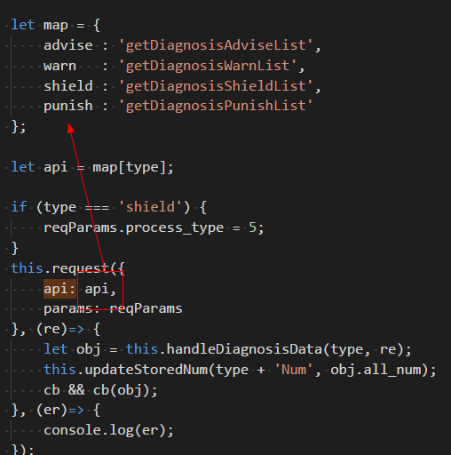
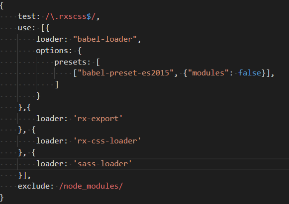

QAP包大小
优化
&nbsp;&nbsp;&nbsp;&nbsp;&nbsp;&nbsp;&nbsp;&nbsp;&nbsp;&nbsp;&nbsp;&nbsp;&nbsp;&nbsp;&nbsp; - by 云飞-小强

1st

[QAP是啥](http://open.taobao.com/docs/doc.htm?spm=a219a.7629140.0.0.wXjdKg&isPublish=0&docType=1&articleId=105545)


[QAP背景](https://yq.aliyun.com/articles/69119?spm=5176.100240.searchblog.93.NHJmRB)


2st

QAP页面

底层,
weex(不关心)

关心啥？

组件层,
nuke

端接口,
QN-SDK

3st

包为啥会
大

Weex原生端
是**多页**的实现

不同的js bundle
将会在**不同**的原生页面中执行

[不同的 js bundle 之间](https://weex.apache.org/cn/wiki/platform-difference.html#mei-you-history-location-navigator-dui-xiang)
将**不共享** js 变量

4st


一个页面


比较简单

几行代码


依赖
rax

依赖
nuke

依赖
QN-SDK

依赖
rxscss

依赖
userInfo


剩余依赖

不算多

实际上？


这么
大


再看代码


userInfo依赖
fetch

fetch依赖
apiList

apiList是啥？

```javascript
var apiList = {
    getUserInfo: {
        server: 'rc',
        url: 'https://mwdsp.superboss.cc/public/getUserInfo.rjson'
    }
    ...
};
module.exports = apiList;
```

所有api的映射

apiList很大


简单计算

33*80

2640

30%
zip压缩

能有
790

5st

怎么省？

能不能拆分
apiList

提前处理map


6st

怎么转换？

babel plugin

[一个例子](http://www.zcfy.cc/article/understanding-asts-by-building-your-own-babel-plugin)

```javascript
var bar = [1, 2, 3];
// babel之后代码
var bar = mori.vector(1, 2, 3);
```

[plugin默认格式](https://github.com/thejameskyle/babel-handbook/blob/master/translations/zh-Hans/plugin-handbook.md#visitors访问者)
```javascript
module.exports = function(babel) {
    var t = babel.types;
    return {
        visitor: {
        }
    };
};
```

[AST](http://astexplorer.net/)
查看抽象语法树


```javascript
module.exports = function(babel) {
  var t = babel.types;
  return {
    visitor: {
      ArrayExpression: function(path) {
            path.replaceWith(
                t.callExpression(
                    t.memberExpression(t.identifier('mori'), t.identifier('vector')),
                    path.node.elements
                )
            }
        }
    };
};
```

目标


```javascript
this.request({
    api: 'getUserInfoNew',
    params: params
}, function (res) {
    calcFee(res.data.count);
})
// 转成
this.request({
    api: 'getUserInfoNew',
    params: params,
    apio: {
        server: 'rc',
        url: 'https://mwdsp.superboss.cc/public/getUserInfo.rjson'
    }
}, function (res) {
    calcFee(res.data.count);
});
```


```javascript
// 第一步
// 要对request进行访问
// 设置CallExpression访问，并判断path的name是不是request
module.exports = function() {
    return {
        visitor: {
            CallExpression: function (path, state) {
                if(t.isMemberExpression(path.node.callee)) {
                    if(path.node.callee.property.name != 'request') {
                        return;
                    }
                }else if(path.node.callee.name != 'request') {
                    return;
                }
        }
    }
}
```

```javascript
// 第二步
// 拿到request里面的参数
// 并取得参数api的值
let obj = path.node.arguments[0];
let pros = obj.properties;
let apiPro;
pros.forEach(val=> {
    if(val.key.name == 'api' || val.key.value == 'api') {
        apiPro = val;
    }
});
```

```javascript
// 第三步
// 从apiList里面拿到api的映射并添加一个参数apio
let param = apiList[apiPro.value.value];
let node  = t.valueToNode(apiList[apiPro.value.value]);
pros.push(t.objectProperty(t.identifier("apio"), node));
```

so?


难题

apiList是对象

业务层
动态调用



改代码

全局搜索替换

也可以

gulp脚本检测一下
```javascript
var reg = new RegExp(/request\(\{\n{0,}\s{0,}api\s{0,}:{0,}\s{0,}(((?!,).)*),{0,}/, 'gim');
```

还能不能再省点？

7st


style全部
继承了common

但是页面里面并没有
全部用到common里面的样式

rxscss
冗余

如何消除
不需要的样式

[tree shaking](https://doc.webpack-china.org/guides/tree-shaking/)

```javascript
// maths.js
export function square(x) {
    return x*x;
}
export function cube(x) {
    return x*x*x;
}
```

```javascript
// main.js
import * as maths from './maths.js';
let xx = maths.square(5);
```

```javascript
// js bundle
"use strict";
/* harmony export (immutable) */ __webpack_exports__["a"] = square;
/* unused harmony export cube */
function square(x) {
    return x * x;
}
function cube(x) {
    return x * x * x;
}
```

unused harmony
会被UglifyJsPlugin压缩的时候去掉

so?

```
// 第一步
// 将rxscss的文件转成单个对象export
// 安装rx-export
cnpm  install rx-export --save-dev
```

修改webpack配置


```javascript
// 第二步
import styles from './list.rxscss';
// 转成
import * as styles from './list.rxscss';
// 安装
cnpm install babel-plugin-transform-rxscss --save-dev
```

修改webpack配置


副作用

必须使用es6
export import

得改代码

长痛不如短痛

改

可以一步步改

再省一点！


在打包的时候
```javascript
if (false) {
    //
}
```
会被UglifyJsPlugin压缩的时候去掉

其它


总结

apiList冗余
rxscss冗余
开发环境代码冗余
组件冗余

最终效果是包大小减少
30%

谢谢
___________________________________
高橋流